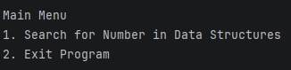
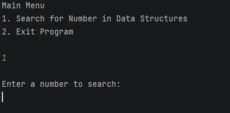
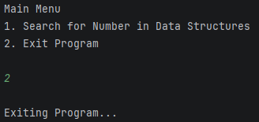
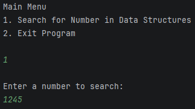
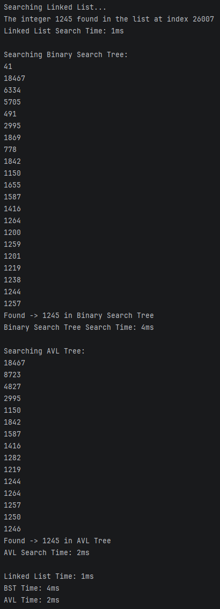

# CXX_List_vs_BST_vs_BBST

### Compares the search execution time between a list, binary search tree and a balanced binary search tree (AVL).

# How to run the Program:

### Step One: Open the Project Folder in your preferred IDE or Text Editor with preferred compiler.

### Step Two: Verify the project contains these files;

    - AVL.cpp
    - BST.cpp
    - LinkedList.cpp
    - MainMenu.cpp
    - AVL.h
    - BST.h
    - LinkeList.h
    - MainMenu.h
    - Node.h
    - main.cpp

### Step Three: Run the Program!

### Step Four: You will be greeted with the main menu.

### Step Five: Ensure the console window is your active window and choose an option (1 or 2)

#### Option 1. "Search for Number in Data Structures"

#### Option 2. "Exit Program"

### Step Six (If Option 1.): Enter a number to search in data structures.

### Step Seven: Let Program Run & View Output for Results

# Final Notes:

### This project was completed closely following a project brief provided bt Torrens University Australia. The purpose of this project was to identify and utilise appropriate algorithms and data structures, apply fundamental OOP concepts and manage code complexity with the use of functions and classes. The overall outcome of the project was to create an application the can compare the search execution times of three separate data structures including a list, BST, and BBST.

# Learning Resources:

### A-Egan-Engineer. (2026). GitHub - A-Egan-Engineer/C-Plus-Singly-Linked-List: Two Singly Linked Lists To Record Efficiency of Creation & Deletion Of Data! GitHub. https://github.com/A-Egan-Engineer/C-Plus-Singly-Linked-ListAbdul 
### Bari. (2018, March 16). 10.1 AVL Tree - Insertion and Rotations. YouTube; Abdul Bari. https://www.youtube.com/watch?v=jDM6_TnYIqEAVL 
### Tree Visualzation. (n.d.). Www.cs.usfca.edu. https://www.cs.usfca.edu/~galles/visualization/AVLtree.html
### HackerRank. (2016). Data Structures: Trees [YouTube Video]. In YouTube. https://www.youtube.com/watch?v=oSWTXtMglKE 
### Programiz. (n.d.). AVL Tree. Www.programiz.com; Parewa Labs Pvt. Ltd. https://www.programiz.com/dsa/avl-tree 
### Sruthy. (2025, April 1). Linked List Data Structure In C++ With Illustration. Www.softwaretestinghelp.com. https://www.softwaretestinghelp.com/linked-list/ 
### Tutorial Point. (2026a). Data Structure and Algorithms - AVL Trees - Tutorialspoint. Www.tutorialspoint.com. https://www.tutorialspoint.com/data_structures_algorithms/avl_tree_algorithm.htm 
### Tutorial Point. (2026b). Data Structures and Algorithms Tree. Www.tutorialspoint.com. https://www.tutorialspoint.com/data_structures_algorithms/tree_data_structure.htm